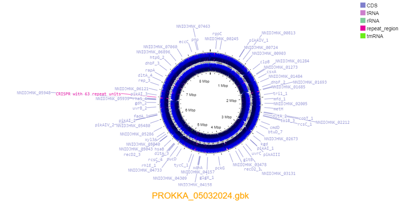
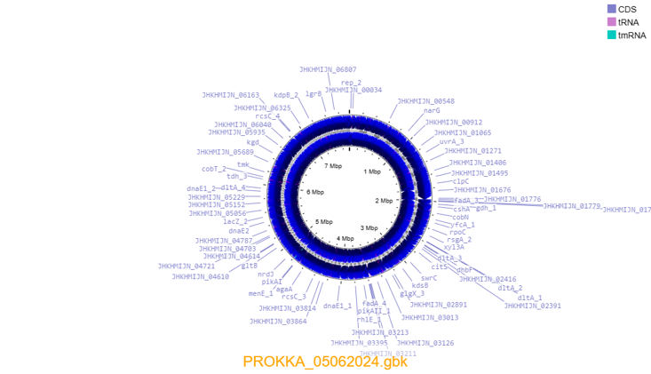
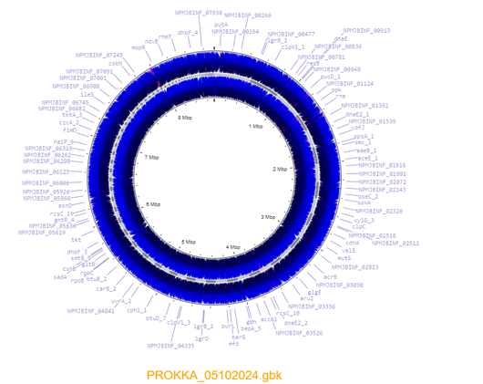

# Gen-711-Final-Project-
Final Project for Gen 711 Class 

  
Background

  The data and methods for this project were taken from https://github.com/Joseph7e/MDIBL-T3-WGS-Tutorial. The goal of the research was to study seaweed-eating microbes collected from MDIBL, Acadia National Park. The data was collected by Anthony Hay, Steven Weicksel, Dana-Lynn Koomoa-Lange, Leah Elliot, Melissa Chisholm, and Princess Rodriguez. The DNA was extracted and Illumina sequencing was used for downstream analysis. 

Methods

  
Read Quality

- Fastqc was run on the samples to summarize read quality and base assessment in HTML format 
- The HTML files were transferred using Powershell and several figures were observed  

  
Trimming

  - Trimmomatic was run on the samples to trim off low-quality reads and adapters 
  - Fastqc was run on the trimmed data to assess read quality  

  

    
Genome Assembly

      - Genome was put together with SPAdes using the forward, reverse, and unpaired reads  
  

  
Genome Assesment

  - QUAST was used to assess how well the genome was put together  
  - BUSCO was used to determine how complete the genome is using highly conserved genes (OrthoDB)  

  
Genome Annotation

  - PROKKA is run to annotate the genome  

  
Organism Identification

  - 16s sequence was extracted from the PROKKA output for BLAST  
  - BLAST was used to identify the most closely related genome to the sample to attempt to identify the organism  
  - The 16s sequence was BLASTed against the contigs generated from SPAdes  

  
Read Mapping

  - The fasta file is run through bwa mem to convert it to a SAM file using the forward and reverse reads of the genome  
  - samtools was used to construct a coverage table of the SAM files  

  
Non-Target Contig Removal

  - blobtools was used to visualize the genome assembly using the contigs file, BLAST hits file, and the SAM file  
  - The graph was generated as a png and downloaded to be observed  

  
Filter Genome Assembly

  - The blobtools tables were filtered by coverage and length  
  - A list of contigs we wanted to keep was constructed  
  - The assembly was filtered based on the list of contigs  
  - Then the final contigs are BLASTed against UNIvec to ensure no contamination is found  

  
For Contamination

  - Take out sequences that came up when the final contigs were BLASTed against UNIvec  
  - Go back to QUAST and run down the methods again using BUSCO, PROKKA, BLAST, bwa mem, samtools, and blobtools  
  - Once the new final list of contigs has gone through the methods again make sure to BLAST against UNIvec to make sure there is no contamination  

  
Genome Visualization

  - The PROKKA .gbk file from after filtering the genome was placed into a program called proksee  
  - Proksee gave a visualization of the genome  
  - Grant JR, Enns E, Marinier E, Mandal A, Herman EK, Chen C, Graham M, Van Domselaar G, and Stothard P​
        Proksee: in-depth characterization and visualization of bacterial genomes​
        Nucleic Acids Research, 2023, gkad326, https://doi.org/10.1093/nar/gkad326  

      

  
Results

  
Fastqc

-Quality of raw reads before trimming shows slightly poor quality

  
Caylin Fastqc untrimmed

R1

R2

  
Graham Fastqc untrimmed

R1

R2

  
Ethan Fastqc untrimmed

R1

R2

-Qulaity of trimmed reads using trimmomatic shown to have improved.

  
Caylin Fastqc trimmed

R1

R2

  
Graham Fastqc trimmed

R1

R2

  
Ethan Fastqc trimmed

R1

R2

  
Quast

-Quast data showing contig lengths GC content and N50 data 
  

    
Caylin

  
    before

  
    after
  

  

    
Graham

  
    before

  
    after
  

  

    
Ethan

  
    before

  
    after
  

  
Blobtools

  Identification of organism through blobtools showing both before and after filtering.
  

    
Caylin

  
  
  

After Filtering 
  
  
  
  
  

  

    
Graham

  
  
  
  

After Filtering 
  
  
  
  
  

  

    
Ethan

  
  
  
  

After Filtering 
  
  
  
  
  

  

  
PROKsee genome visualization

  
  
  

